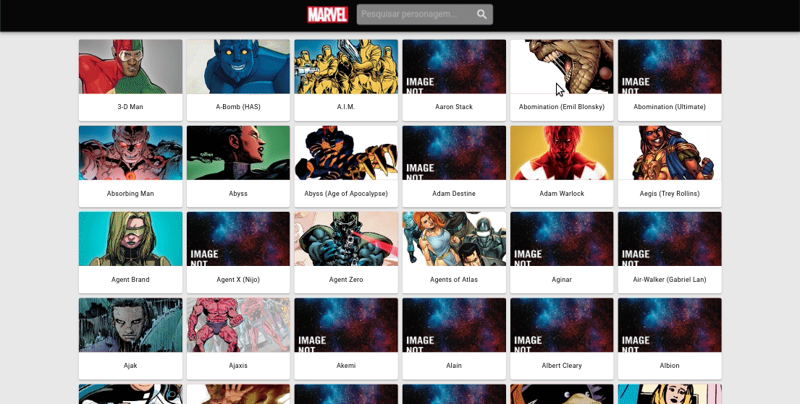
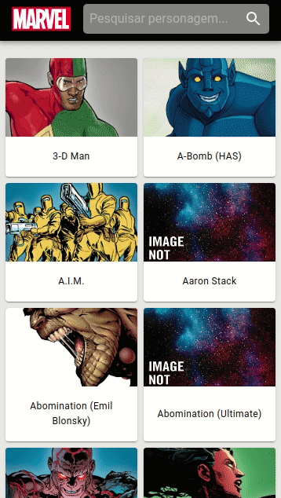

# marvel-characters v0.0

Aplicação para visualização de personagens marvel.

### Web Desktop



### Web Mobile



## Execução do projeto

Definir um arquivo com nome `env.local`

```
REACT_APP_API_URL=https://gateway.marvel.com:443/v1/public/
REACT_APP_API_KEY_PUBLIC={SUA_MARVEL_KEY_PUBLICA}
REACT_APP_API_KEY_PRIVATE={SUA_MARVEL_KEY_PRIVADA}
```

E executar `yarn install` e `yarn start`

Para executar os tests `yarn test`

## Observações:

Uso de atomic design.

Uso de ITCSS adaptado para CSS modules.

Create-react-app utiliza autoprefixer, que irá adicionar os prefixos no CSS para maior compatibilidade. Caso necessário configurar "browserslist" no package.json, e definir os browsers e versões suportadas.

## ATENÇÃO

Foi utilizado variáveis de ambiente (dotenv) para lidar com a API_KEY, isto EXPÕE a chave e não deve ser utilizado em produção. Devido as restrições de tempo optou-se por esse caminho, apenas como forma de demonstração.

### ToDO:

Criar pipeline gitlab

Arrumar detalhes series

Implementar infinite scroll.

Melhorar animações de saída da página de séries.

Animação imagem carregando.

<!-- Estudar styled components -->
